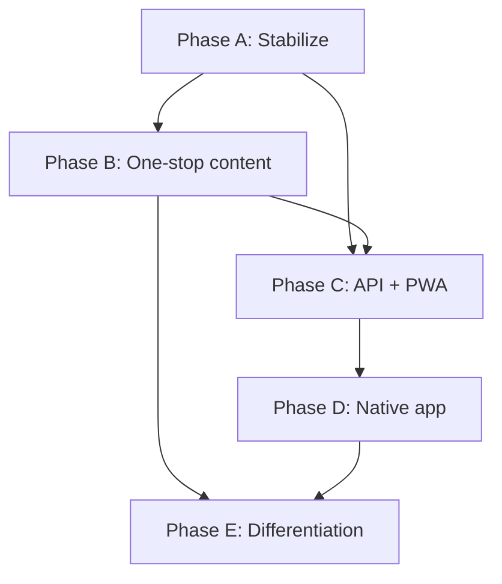

# 6. Phased Roadmap

> Implementation phases A–E with priorities, effort estimates, and checklists.

**Team:** 2 people (developer + project lead) with AI assist  
**Approach:** Evolve existing platform — see [05-evolve-not-rebuild.md](./05-evolve-not-rebuild.md)

---

## Overview

| Phase | Focus | Timeline | Status |
|-------|-------|----------|--------|
| **A** | Stabilize & launch confidence | 2–4 weeks | 🟡 In progress |
| **B** | "Everything in one place" | 1–2 months | 🔲 Not started |
| **C** | Mobile-ready API + PWA | ~1 month | 🔄 In progress |
| **D** | Native mobile app | 2–3 months | 🔄 In progress |
| **E** | Differentiation & scale | Ongoing | 🔲 Not started |

---

## Phase A — Stabilize & launch confidence

**Goal:** Reliable production site with no "Coming Soon" gaps and core discoverability.

| # | Task | Effort | Notes |
|---|------|--------|-------|
| A1 | Fix production deployment (Coolify) | — | ✅ Resolved |
| A2 | Publish all CMS pages (about, plan, contact) | Low | Commission content needed |
| A3 | Global search (attractions, guides, news) | Medium | High impact for "find anything" |
| A4 | Inquiry inbox in admin | Low | DB table + admin list; keep email notify |
| A5 | Basic Amharic for key public pages | Medium | Start with nav + homepage + plan |
| A6 | Admin dashboard widgets (pending bookings, drafts) | Low | |
| A7 | Bulk publish on announcements | Low | |

### Phase A checklist

- [x] Production deploy green on Coolify
- [ ] No public "Coming Soon" on core pages
- [x] Search live on public site
- [x] Contact inquiries visible in `/admin`
- [x] Amharic visible on at least homepage + navigation
- [ ] Commission staff walkthrough completed

### Phase A — discussion topics

- Search UI: modal vs dedicated page vs navbar inline?
- Amharic: full page content vs key strings first?
- Inquiry inbox: reply from admin or read-only + email?

---

## Phase B — Everything in one place

**Goal:** Tourist can plan a full trip without leaving the site.

| # | Task | Effort | Notes |
|---|------|--------|-------|
| B1 | Services / partners directory | Medium | Hotels, restaurants, coffee, transport, forex |
| B2 | Itinerary builder | Medium–High | Pre-built + optional user custom day plans |
| B3 | Events calendar view (public + admin) | Medium | Upgrade from list-only announcements |
| B4 | Structured Plan Your Trip | Medium | Visas, best time, packing, Dire Dawa transfer, costs |
| B5 | Attraction enhancements | Low–Medium | Opening hours, best time, tips, audio URL field |
| B6 | Downloadable PDF guide | Medium | Generated from CMS content |
| B7 | Admin analytics dashboard | Medium | Page views, bookings, top content |
| B8 | AI knowledge admin editor | Low–Medium | Control chat without code |
| B9 | Preview before publish | Medium | Hero + static pages |

### Phase B checklist

- [x] Partners module in admin + public listing
- [x] At least 3 pre-built itineraries published (via seed)
- [x] Calendar view for events
- [x] Plan Your Trip fully structured (not just prose)
- [x] PDF guide downloadable from plan page
- [x] Analytics visible in admin
- [x] B8 AI knowledge admin editor (extra knowledge field in Settings)
- [ ] B9 Preview before publish (hero + static pages)

### Phase B — discussion topics

- Partners: who enters data? Verification process?
- Itineraries: fixed templates only or drag-and-drop builder?
- PDF: static export vs dynamic per-itinerary?
- Arabic language: Phase B or C?

---

## Phase C — Mobile-ready API + PWA

**Goal:** Same data powers web and future app; web works offline for key content.

| # | Task | Effort | Notes |
|---|------|--------|-------|
| C1 | Public REST API `/api/v1/*` | Medium | Wrap existing `*-fns.ts` |
| C2 | Shared types / validators package | Low–Medium | Prep for monorepo |
| C3 | PWA manifest + service worker | Medium | Cache key pages + map |
| C4 | QR codes for attractions | Low | Print materials → deep links |
| C5 | API documentation | Low | OpenAPI or markdown contract |
| C6 | Offline map tile strategy | Medium | Jugol area cache |

### Phase C checklist

- [x] All public content available via `/api/v1`
- [x] PWA installable on mobile browsers (manifest + service worker)
- [x] QR codes on attraction detail pages
- [x] API contract documented ([09-api-v1.md](./09-api-v1.md))
- [x] Offline map tile caching (OSM tiles, runtime cache in SW)
- [x] OpenAPI machine-readable spec (`openapi/v1.yaml`)

---

## Phase D — Native mobile app

**Goal:** App Store + Play Store launch promoted from website.

| # | Task | Effort | Notes |
|---|------|--------|-------|
| D1 | Expo app scaffold + monorepo | Medium | |
| D2 | Map + attractions (offline) | High | Core value |
| D3 | Itineraries + favorites | Medium | |
| D4 | Guide booking + status | Medium | Reuse API |
| D5 | Push notifications | Medium | Events, booking updates |
| D6 | App Store / Play Store submission | Low–Medium | Assets, review |
| D7 | "Download our app" web section | Low | Like Visit Dubai |

### Phase D checklist

- [x] Expo app scaffold + monorepo (`apps/mobile`, `packages/api-client`)
- [x] Offline Jugol map (react-native-maps + tile prefetch)
- [x] Favorites (local storage on Plan tab)
- [x] Guide booking + status lookup (`/book`, `/book/status`)
- [x] Push notifications (Expo Push — booking updates + event/news alerts)
- [ ] iOS + Android builds in TestFlight / internal testing
- [ ] Booking flow end-to-end on device
- [ ] Store listings live
- [x] Website promotes app install (PWA + coming soon banner)

**Pivot (June 2026):** Expo work is frozen; native app continues as **Flutter** — see [10-flutter-migration-plan.md](./10-flutter-migration-plan.md).

---

## Phase E — Differentiation & scale

**Goal:** Features that make Visit Harar memorable and hard to copy.

| # | Task | Effort | Notes |
|---|------|--------|-------|
| E1 | Audio guides (admin-uploaded MP3) | Medium | Per attraction |
| E2 | Full i18n (Amharic, Arabic, Oromo) | High | |
| E3 | Partner self-service portal | High | Verified businesses |
| E4 | UGC photo gallery (moderated) | Medium | |
| E5 | Guide-scoped editor role | Medium | |
| E6 | Editorial approval workflow | Medium | |
| E7 | Object storage for media (S3/R2) | Medium | When volume grows |
| E8 | Automated test suite | Medium | Booking, auth, publish |
| E9 | Accessibility audit (WCAG) | Medium | |
| E10 | AR alleyway navigation | High | Ambitious — evaluate later |

---

## Dependency graph

---

## What we're NOT doing in v1

- Online payment processing
- Full partner self-service portal
- 10-language launch
- AR/VR experiences
- Replacing the CMS with WordPress

---

## Roadmap review cadence

- **Weekly:** Phase task progress, blockers
- **After Phase A:** UI/UX audit findings folded into Phase B priorities
- **After Phase B:** Commission feedback session before mobile investment
